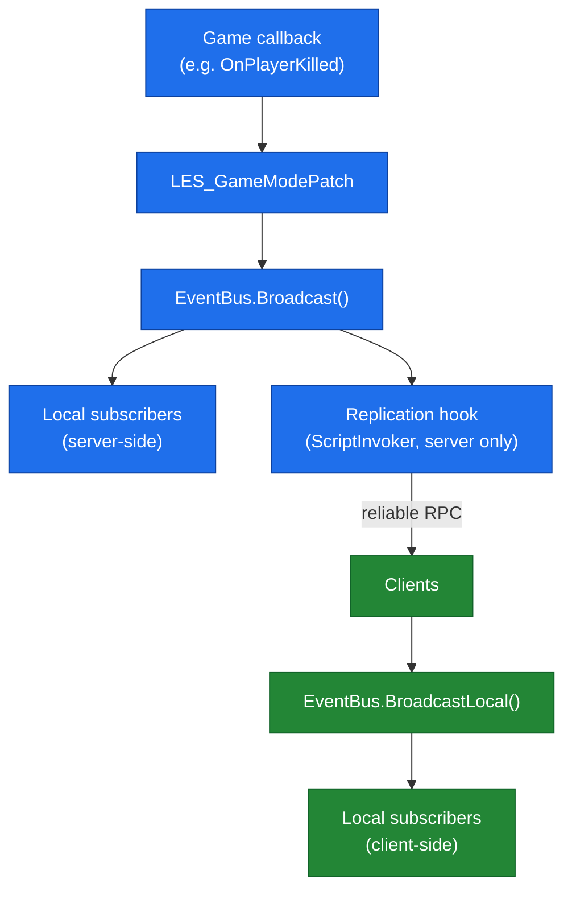
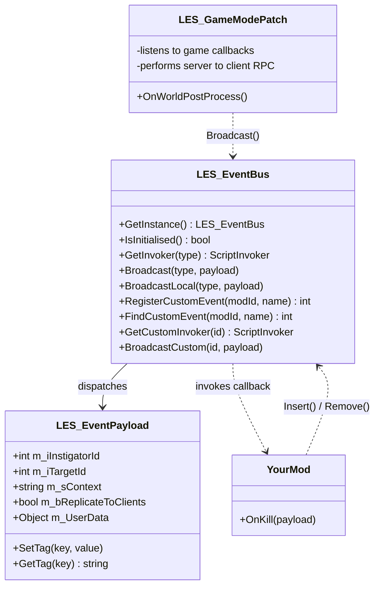
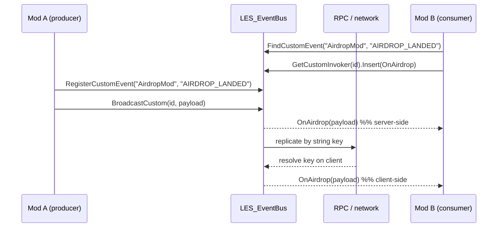

# LES — Lightweight Event System

A tiny **publish/subscribe event bus** for Arma Reforger (Enfusion engine). One shared channel for game events — with server→client replication built in.

Arma Reforger **1.7.x** · APL-SA · zero setup: load the mod and it works.

---

## The problem

You're making a mod that reacts to kills — a kill feed, a bounty system, stat tracking, whatever. In vanilla Enfusion that means:

```cpp
// Every mod author writes this same boilerplate:
modded class SCR_BaseGameMode
{
    override void OnWorldPostProcess(World world)
    {
        super.OnWorldPostProcess(world);
        GetOnPlayerKilled().Insert(MyMod_OnKilled);   // server-only!
    }

    protected void MyMod_OnKilled(SCR_InstigatorContextData data)
    {
        // ...and this fires ONLY on the server. Want your client-side UI
        // to know about it? Now you're writing your own RplComponent + RPC.
    }
}
```

Three problems:

1. **Every mod patches `SCR_BaseGameMode` again** — five mods, five copies of the same wiring, plus method-name collisions between them.
2. **Base-game callbacks fire server-side only.** Getting the event to a client (for UI, sounds, notifications) means writing your own RPC transport — the part most mod authors get wrong.
3. **Mods can't talk to each other.** Your airdrop mod has no sane way to tell someone else's economy mod "an airdrop just landed."

## The solution

LES does the wiring once. You subscribe in one line and get the event **on server and clients alike**:

```cpp
// Your entire kill-feed mod:
LES_EventBus.GetInstance().GetInvoker(LES_EEventType.PLAYER_KILLED).Insert(OnKill);

void OnKill(LES_EventPayload payload)
{
    // Runs on the server AND on every client — replication already handled.
    Print(payload.m_iInstigatorId.ToString() + " killed " + payload.m_iTargetId);
}
```

No `modded class`. No RplComponent. No RPC code. And because every mod goes through the same bus, mods can also publish **custom events** to each other:

```cpp
// Mod A announces:
int evt = LES_EventBus.GetInstance().RegisterCustomEvent("AirdropMod", "AIRDROP_LANDED");
LES_EventPayload p = new LES_EventPayload(-1, -1, "north_airfield");
p.SetTag("cargo", "supplies");
LES_EventBus.GetInstance().BroadcastCustom(evt, p);

// Mod B (a completely different mod, no dependency on Mod A's code) reacts —
// on the server AND on clients, since custom events replicate too (v1.1):
int evt = LES_EventBus.GetInstance().FindCustomEvent("AirdropMod", "AIRDROP_LANDED");
if (evt != -1)
    LES_EventBus.GetInstance().GetCustomInvoker(evt).Insert(OnAirdrop);
```

---

## Built-in events

| Event | Instigator | Target | Context / tags |
|-------|-----------|--------|----------------|
| `PLAYER_KILLED` | killer ID | victim ID | `"killed"` |
| `PLAYER_CONNECTED` | player ID | — | `"connected"` |
| `PLAYER_DISCONNECTED` | player ID | — | `"disconnected"`, tag `cause` |
| `VEHICLE_DESTROYED` | killer ID | — | vehicle prefab name |
| `ZONE_CAPTURED` | *reserved* | — | *(1.7.x capture API pending — use a custom event for now)* |

All built-in events are replicated to clients automatically (reliable RPC). Set `payload.m_bReplicateToClients = false` to keep one server-side.

## How it works

`LES_EventBus` is a **pure local dispatcher** — it knows nothing about networking. Replication is layered on top via dependency inversion: the bus exposes a replication hook (`ScriptInvoker`), and the GameMode patch subscribes to it and performs the RPC. The GameMode always exists and always has an `RplComponent`, which is why LES needs no World Editor setup.



The blue path runs on the server; the green path is what every client sees once the RPC arrives. A payload with `m_bReplicateToClients = false` simply stops at the replication hook and never crosses the network.

Just two core files:

| File | Responsibility |
|------|----------------|
| `LES_EventBus.c` | Pub/sub core, payload type, custom-event registry |
| `LES_GameModePatch.c` | Init/teardown, built-in listeners, server→client RPC — all in one file (Enforce Script requires `Insert()` targets to be visible in the same compilation scope) |
| `Examples/` | Worked examples — safe to delete |

### How the pieces fit together



### Custom-event round trip (mod-to-mod)



## Usage

### Subscribe / unsubscribe (component pattern)

```cpp
class MyConsumer : ScriptComponent
{
    override void OnPostInit(IEntity owner)
    {
        super.OnPostInit(owner);
        LES_EventBus.GetInstance().GetInvoker(LES_EEventType.PLAYER_KILLED).Insert(OnKill);
    }

    override void OnDelete(IEntity owner)
    {
        if (LES_EventBus.IsInitialised())
            LES_EventBus.GetInstance().GetInvoker(LES_EEventType.PLAYER_KILLED).Remove(OnKill);
        super.OnDelete(owner);
    }

    void OnKill(LES_EventPayload payload) { /* ... */ }
}
```

**Always pair `Insert` with `Remove`** so callbacks never fire on destroyed objects. `IsInitialised()` avoids recreating the bus during world teardown.

### Payload

| Field / method | Description |
|----------------|-------------|
| `m_iInstigatorId`, `m_iTargetId` | Player/entity IDs (`-1` if N/A) |
| `m_sContext` | Freeform context string |
| `SetTag / GetTag / HasTag / GetTagCount` | String metadata — **replicated** |
| `m_UserData` | Any script object — **server-only**, never replicated |
| `m_bReplicateToClients` | `false` = keep the event server-side |

### Emitting events yourself

```cpp
LES_EventPayload p = new LES_EventPayload(killerId, victimId, "killed");
LES_EventBus.GetInstance().Broadcast(LES_EEventType.PLAYER_KILLED, p);
```

### Custom events (mod-to-mod)

Replicated to clients like built-ins (v1.1+). Replication travels by string key, so producer and subscribers just register the same `modId`/`eventName` on any machine — no ordering or ID coordination needed. `m_UserData` never replicates; use tags for client-bound data.

| Method | Purpose |
|--------|---------|
| `RegisterCustomEvent(modId, name)` | Define an event, get its runtime ID |
| `FindCustomEvent(modId, name)` | Resolve an ID someone else registered (`-1` if absent) |
| `GetCustomInvoker(id)` | `.Insert(cb)` / `.Remove(cb)` to (un)subscribe |
| `BroadcastCustom(id, payload)` | Fire it |

## Examples included

- **`LES_KillFeedComponent.c`** — reference consumer with the correct subscribe/unsubscribe lifecycle. Attach to any entity (e.g. the GameMode prefab).
- **`LES_KillFeedGameMode.c`** — zero-setup kill feed for quick testing; just load and watch the log.
- **`LES_CustomEventExample.c`** — full custom-event round trip (register → subscribe → broadcast).

> The two GameMode examples both override `OnGameStart` — enable only one at a time. The component example never conflicts.

## Installation

1. Subscribe on the Arma Reforger Workshop, or drop `scripts/Game/LES/` into your addon.
2. Add LES to your server/launcher mod list.
3. Done. Look for `[LES] Initialised` in the log.

## License

[Arma Public License Share Alike (APL-SA)](https://www.bohemia.net/community/licenses/arma-public-license-share-alike) — free to use and build upon in any Arma mod with attribution; derivatives must keep the same license.
